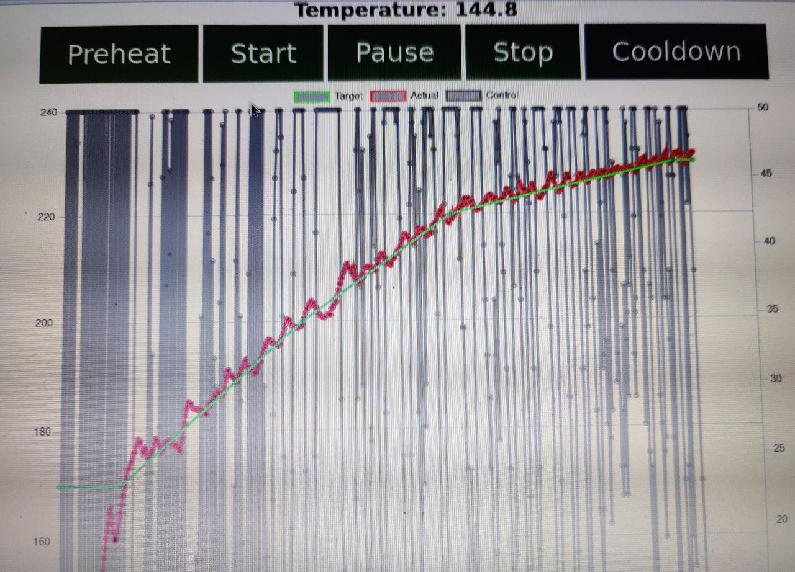
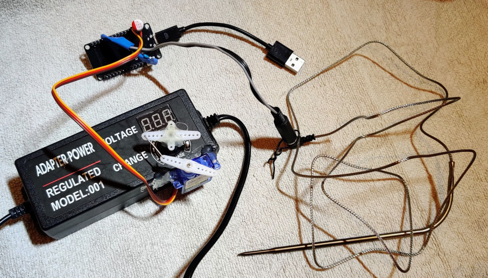
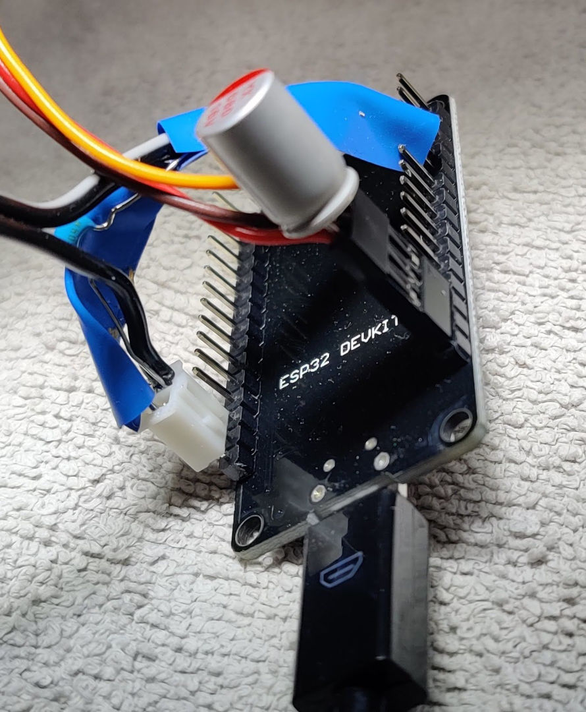
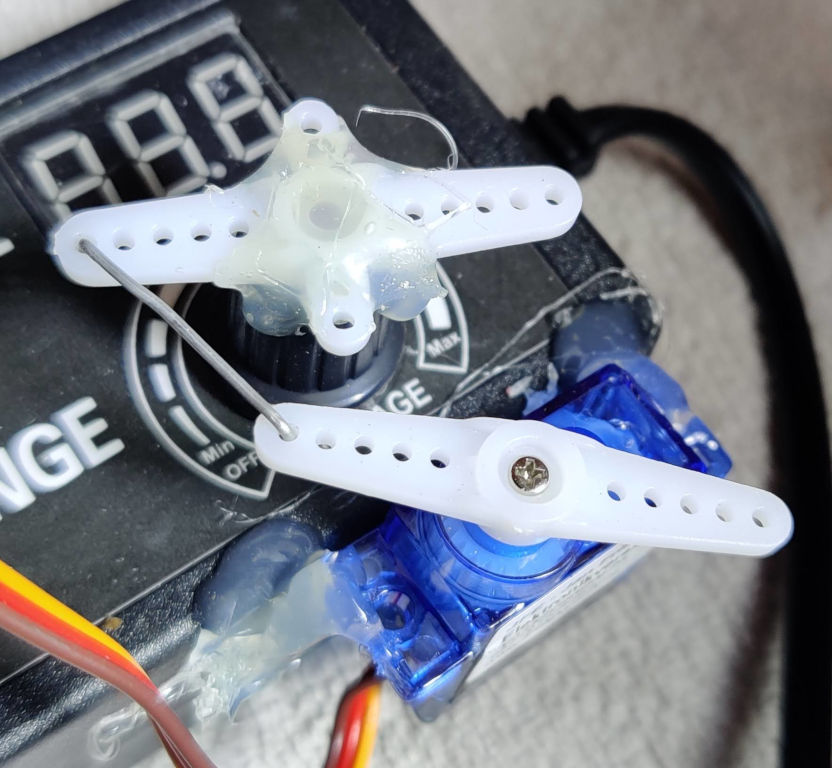
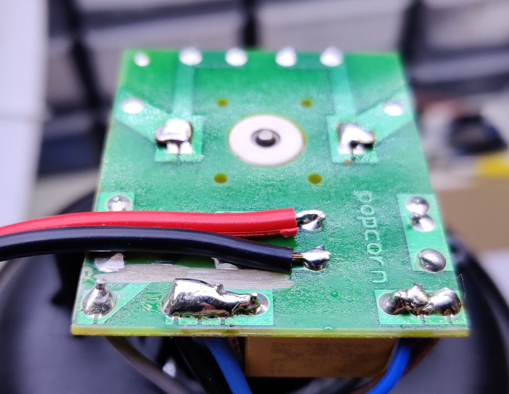

# Roasty McRoastface
_The overly simple coffee roasting controller_

https://github.com/sarumpaet/RoastyMcRoastface

So that popcorn maker that you MacGyvered to roast your coffee beans turns out to be a bit tedious to babysit while roasting.
Also, you want some better control over its temperature curve.
What you _don't_ want is buying a huge proper roaster or assemble anything overly complex.

Time for **Roasty McRoastface**.

* Simple inexpensive ESP32-based design to control temperature curve.
* No PCB needed. No tinkering with 110/230V needed.
* Uses a roasting thermometer for temperature measurement.
* Controls fan/temperature using a servo connected to the fan power supply voltage adjustment control.
* ESP32 side firmware is minimal. Actual control is done in JavaScript on web client side. It's quite hackable.
* Adjustable temperature curve that gets stored in your browser.
* Initial Wifi configuration done via access point mode wifi.
* Failsafe: If connection to the JavaScript control client is lost, the fan gets turned up.
* Heating can get turned off at cycle end using a wifi-enabled power outlet (e.g., Tasmota).
* Future: Temperature probe sanity checks and failsafe.

Some things Roasty cannot do:
* For simplicity's sake there's no own display. Everything is controlled via the web client.
* The web client is needed during operation. Make sure your wifi is stable and your phone or notebook doesn't go to sleep while roasting.

**THIS IS WORK IN PROGRESS AND NOT END USER READY IN ANY WAY.**

**Beware! Stuff is running at high temperatures that represent a fire hazard.**
**Bean chaff is flammable. Do not run unsupervised. Use at your own risk.**

The web UI.

## Hardware

Roasting thermometer probe, controller, fan power source.

* ESP32 Dev Kit v1
* 100nF capacitor parallel to (NTC) temperature probe
* Probe between 3.3V and D35/GPIX35
* Resistor between GND and D35/GPIX35 (value depends on probe, 3.8k worked fine for me, make sure max current is about 1mA)
* Servo connected to VIN, GND, GPIO13 (Vcc and GND wires have been switched compared to normal servo pinout in pic)

Hot glue to the rescue.
* Make sure the servo range physically doesn't allow running the fan very low or even turning it off. Fire hazard!

Modded PC3751 popcorn machine.
* Note the fan has been disconnected from the 230V supply by cutting PCB traces.
* Make sure the fan wires are fastened in place securely. Best glue them additionally.
